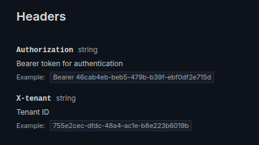

# Victormgomes/Scramble

## Useful magic extensions for dedoc/scramble package

---

### Extensions provided

#### AddAuthorizationHeader

To automatically add an Authorization header for authenticated routes

#### AddTenantHeader

To automatically add a Tenant header for Tenant routes

### Installation

```bash
composer require victormgomes/scramble
```

### Usage

Register any extension provided in the scramble config file

```php
//config/scramble.php
...
'extensions' => [
        \Victormgomes\Scramble\Extensions\AddAuthorizationHeader::class,
        \Victormgomes\Scramble\Extensions\AddTenantHeader::class,
    ]
...
```

The result of registering these extensions above will look like:



### Many others extensions coming soon

Thanks!
